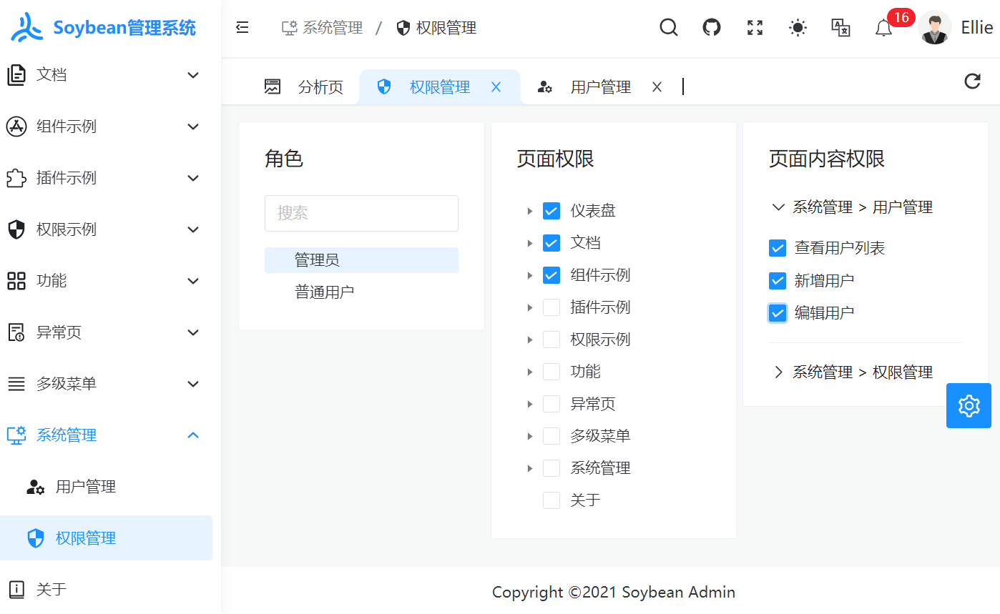
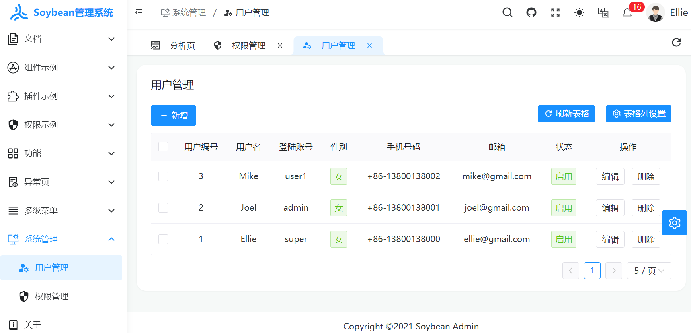
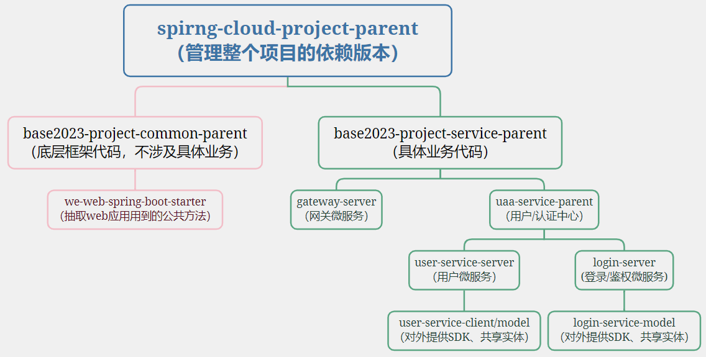

# Springboot3 + JDK17 分布式项目

## 简介

本项目完全开源，无任何带有品牌标识的署名。系统从零开始搭建，层次结构严谨，注释齐全，减少过度封装，尽量提高代码的可读性、可研究度。模块之间松耦合，可维护性高，响应信息支持多语言。所采用的技术均无代码入侵。依赖最简化，减少三方库的引入和使用，降低学习成本，提高了扩展性。项目采用微服务分布式架构，Springboot3，JDK17，Spring Cloud Alibaba，Nacos等。前端使用Vue3 + TypeScript + NaiveUI。微服务中间件逐步引入，用到什么引入什么，方便了解各个中间件的使用场景。

## 功能
1. 响应信息支持多语言
2. 登陆 + 鉴权：使用SpringSecurity框架实现多种方式登陆，已支持用户名/密码、手机号/短信验证码登陆。

## 项目预览
<table>
    <tr>
        <td></td>
        <td></td>
    </tr>
</table>

## 项目搭建
准备运行环境: JDK17、Redis、Mysql8、Nacos。
启动 gateway-server、login-server、user-service-server 三个微服务

## 前端项目：
项目地址：
https://github.com/AllenDengMs/base2023-spring-cloud-frontend

原前端开源项目地址：
https://github.com/honghuangdc/soybean-admin

## 项目结构

项目/模块包名含义：
1. -parent：以parent结尾项目，是<packaging>pom</packaging>类型的顶层项目，只负责管理依赖dependency的版本号version。比如spring-boot-starter-parent
2. -client：以client结尾的项目，是sdk，给外部微服务调用本微服务提供的sdk。只存放一些openfeign接口和一些必要常量、实体，比如user-service-client。
3. -model：以model结尾的项目，只存放一些pojo、dto等实体类，无任何业务逻辑。
4. -server: 以server结尾的项目，是一个可以启动的微服务。
5. -dependencies: 以dependencies结尾的项目，是<packaging>pom</packaging>类型项目，只负责在<dependencyManagement>里面声明三方依赖的版本号，项目本身不引入任何依赖。

项目层次结构：
<table>
    <tr>
        <td></td>
    </tr>
</table>

## 模块说明
```lua
base2023-dependencies -- 管理依赖版本项目

spirng-cloud-project-parent -- 引入【管理依赖版本项目】来管理依赖版本，父项目
│  ├─base2023-project-common-parent -- 工具包，父项目
│  │  ├─we-database-spring-boot-starter -- 数据库相关可复用代码, 抽取到此项目
│  │  ├─we-project-commons -- 其他可复用代码，工具包
│  │  ├─we-web-spring-boot-starter -- web服务相关可复用代码, 抽取到此项目
│  ├─base2023-project-service-parent -- 业务代码，父项目
│  │  ├─gateway-server -- 网关，微服务
│  │  ├─base2023-project-service-parent -- 父项目
│  │  │  ├─login-model -- 从login-server中抽出来的公共实体，无业务逻辑
│  │  │  ├─login-server -- 登陆/鉴权，微服务
│  │  │  ├─user-service-client -- 对外暴露user-service-server接口的sdk
│  │  │  ├─user-service-model -- 从user-service-server中抽出来的公共实体，无业务逻辑
│  │  │  ├─user-service-server -- 用户中心，微服务
```

技术选型：

| 软件    | 版本    | 后端框架                 | 版本             |
|-------|-------|----------------------|----------------|
| JDK   | 17    | Spring Boot          | 3.0.2          |
| MySql | 8.0   | Spring Cloud Alibaba | 2022.0.0.0-RC2 |
| Redis | 7.0   | Spring Cloud         | 2022.0.0       |
| Nacos | 2.2.1 | Mybatis-plus         | 最新版            |
|       |       | Spring Security      | 6.0.1          |

## 项目构建教程

持续更新中...

## 更新日志

| 版本                                    | 更新时间       |
|---------------------------------------|------------|
| [v1.0](_doc%2Flog%2Fv1.0_20230825.md) | 2023-08-25 |
